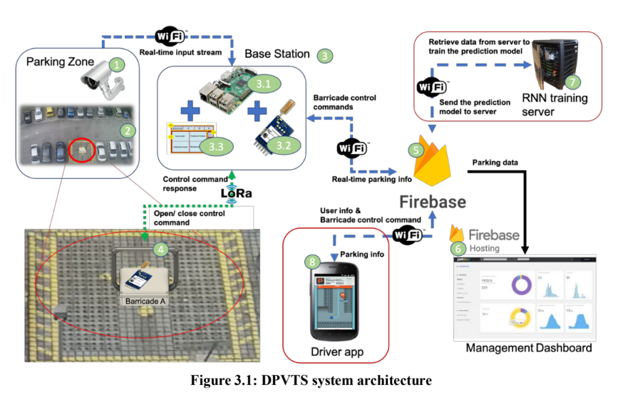
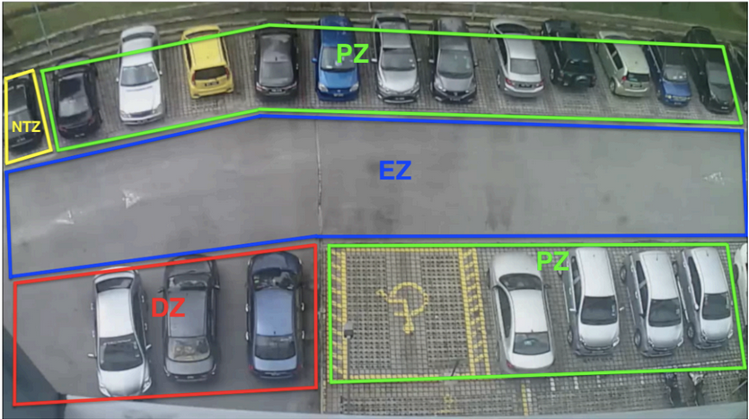
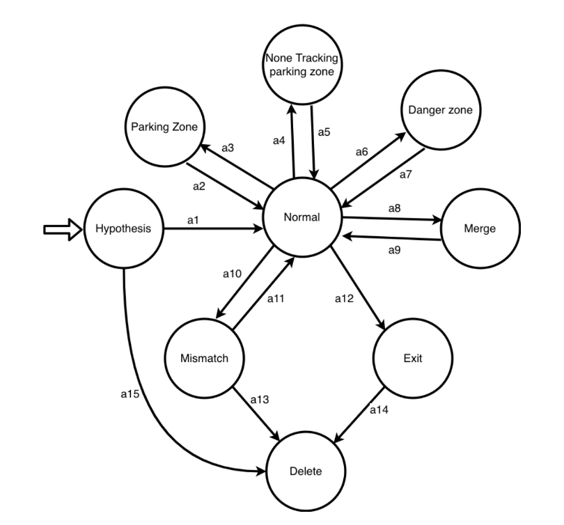
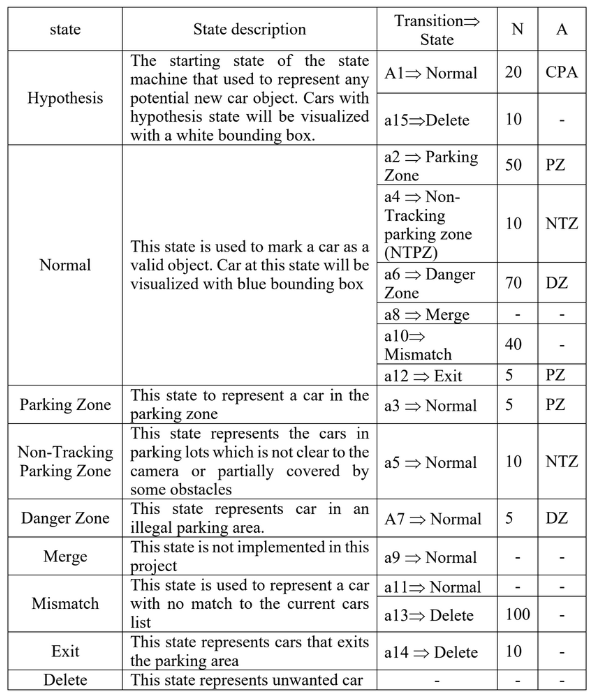
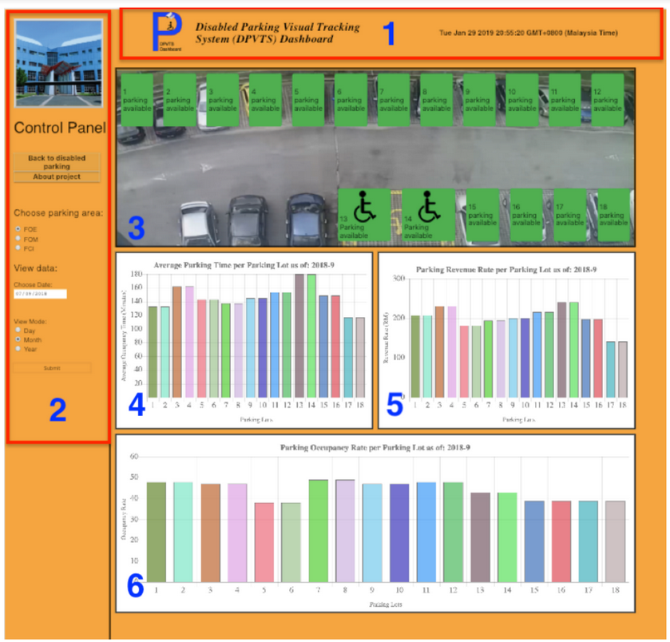
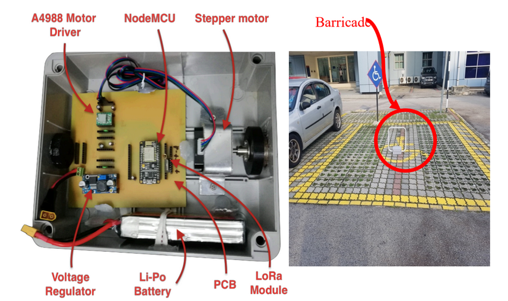
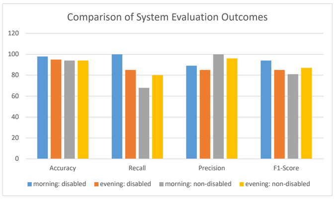

https://user-images.githubusercontent.com/24761719/212996705-40ecbf8d-17ab-483c-9282-bbe6052d78ab.mp4

# Disabled Parking Visual Traking System (DPVTS)

This is the source code of the DPVTS project. It is a thesis project for electronics engineering bachelor degree at Multimedia University, Cyberjaya, Malaysia. The system architecture is as shown above. The RNN training and Driver app are a complementary elements that are developed by other coleages while all of the other elements are developed in this project.

## Developed by: Munaib Al-Helali
## Supervised by: Cheong Soon Nyean
## Year: 2019

## Programming languages used:
- Python: base station
- C++: barricade
- HTML, CSS, JavaScript: web dashboard

## Other technologies or libraries:
- OpenCV
- Numpy 
- Firebase database
- LoRA
- Raspberry Pi3
- Arduino UNO

## The project consists of three parts: 
### Base station: 
is a Raspberry Pi3 based station to detect and track cars in the parking area and update the parking lots status accordingly. The parking area is divided into different zones as follows:

 The following images explain the state machine used to track the status of the parking lots:
 

### Dashboard: 
is a web dashboard to visualize and track the parking trends in the parking area over time.

### Barricade: 
is a device based on arduino. It is installed at the center of earch parking lot and can be controled through a dedicated android application or through the base station. It communicate with the base station through LoRa module over long distance.

## Evaluation

